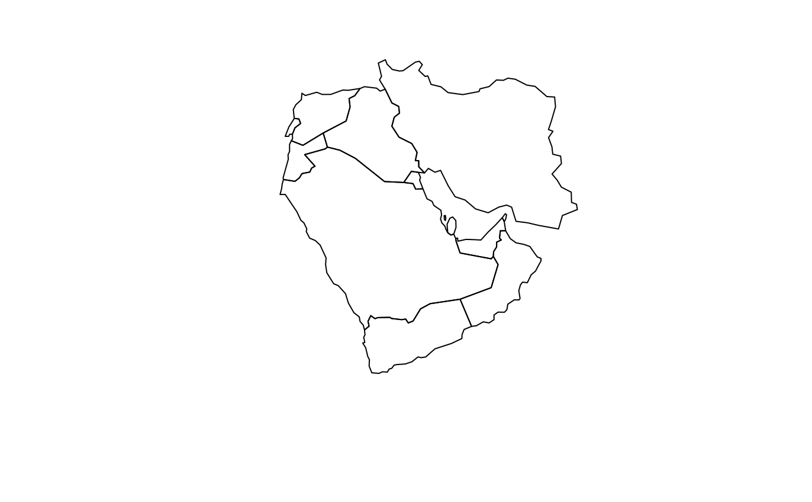

# Introduction to R {.unnumbered}

## Introduction {.unnumbered}

This section is designed to ensure you are familiar with the <tt>R</tt> environment. It also provides guidelines on how to use the Swirl package in <tt>R</tt>: a built-in tutorial that familiarizes users with basic <tt>R</tt> commands. I thank Julia de Romémont for sharing an earlier version of this introductory section. 

## Getting started with R at home {.unnumbered}

Given that we're all working from home these days, you'll need to download R and RStudio onto your own devices. R is the name of the programming language that we'll be using for coding exercises; RStudio is the IDE ("Integrated Development Environment"), i.e., the piece of software that almost everyone uses when working in R. 

You can download both of these on Windows and Mac easily and for free. This is one of the first reasons to use an "open-source" programming language: it's free! And this means everyone has access to it. 

1. Install R for Mac from here: https://cran.r-project.org/bin/macosx/. Install R for Windows from here: https://cran.r-project.org/bin/windows/base/.

2. Download RStudio for Windows or Mac from here: https://rstudio.com/products/rstudio/download/, choosing the Free version: this is what most people use and is more than enough for all of our needs.

**All programs are free. Make sure to load everything listed above for your operating system or R will not work properly!**

## Some basic information {.unnumbered}

+ A script is a text file in which you write your commands (code) and comments.

+ If you put the <tt>#</tt> character in front of a line of text this line will not be executed; this is useful to add comments to your script!

+ <tt>R</tt> is case sensitive, so be careful when typing. 

+ To send code from the script to the console, highlight the relevant line of code in your script and click on <tt>Run</tt>, or select the line and hit <tt>ctrl+enter</tt> on PCR or <tt>cmd+enter</tt> on Mac

+ Access help files for <tt>R</tt> functions by preceding the name of the function with <tt>?</tt> (e.g., <tt>?table</tt>)

+ By pressing the <tt>up</tt> key, you can go back to the commands you have used before

+ Press the <tt>tab</tt> key to auto-complete variable names and commands

## Getting Started in RStudio {.unnumbered}

Begin by opening RStudio (located on the desktop). Your first task is to create a new script (this is where we will write our commands). To do so, click: 

```{r eval=FALSE}
File --> NewFile --> RScript
```

Your screen should now have four panes:

+ the Script (top left)

+ the Console (bottom left)

+ the Environment/History (top right)

+ Files/Plots/Packages/Help/Viewer (bottom right)

## A simple example {.unnumbered}

The Script (top left) is where we write our commands for R. You can try this out for a first time by writing a small snipped of code as follows:

```{r, eval=TRUE}

x <- "I can't wait to learn Quantitative Research Methods" #Note the quotation marks!

```
To tell R to run the command, highlight the relevant row in your script and click the <tt>Run</tt> button (top right of the Script) - or hold down <tt>ctrl+enter</tt> on Windows or <tt>cmd+enter</tt> on Mac - to send the command to the Console (bottom left), where the actual evaluation and calculations are taking place. These shortcut keys will become very familiar to you very quickly!

Running the command above creates an object named ‘x’, that contains the words of your message.

You can now see ‘x’ in the Environment (top right). To view what is contained in x, type in the Console (bottom left):
```{r eval=TRUE}

print(x)

# or alternatively you can just type:

x

```

## Loading packages {.unnumbered}
The 'base' version of <tt>R</tt> is very powerful but it will not be able to do everything on its own, at least not with ease. For more technical or specialized forms of analysis, we will need to load new packages. 

This is when we will need to install a so-called ‘package’---a program that includes new tools (i.e., functions) to carry out specific tasks. You can think of them as 'extensions' enhancing <tt>R</tt>'s capacities. To take one example, we might want to do something a little more exciting than print how excited we are about this course. Let's make a map instead.

This might sound technical. But the beauty of the packaged extensions of <tt>R</tt> is that they contain functions to perform specialized types of analysis with ease. We'll first need to install one of these packages, which you can do as below:

```{r, eval=FALSE}
install.packages("rworldmap")
```

You can load the most recent version of packages using RStudio (by clicking <tt>Install</tt> under the packages tab of the bottom right pane and typing the name of your desired package) and ensuring the top drop down menu says install from Repository (CRAN). Keep <tt>Install dependencies</tt> ticked.

After the package is installed, we then need to load it into our environment by typing <tt>library(<insert name of package here>)</tt>. Note that, here, you don't need to wrap the name of the package in quotation marks. So this will do the trick:

```{r, eval=F}
library(rworldmap)
worldmap <- getMap()
```

What now? Well, we could have a look through what this package can do by typing `vignette("rworldmap")`, which will guide you through what is contained in this package. Alternatively, you can go straight ahead and plot your first map. 

```{r, eval=F}
plot(worldmap[which(worldmap$GLOCAF=="Middle East"),])
```
```{r, echo=FALSE, out.width="100%", fig.align="center"}

```


And we might then want to add a title to this map. Remember we stored our first message to ourselves as "x" above, and this is just a string of words, or a "character" object. We can add this to our map with ease, as below:

```{r, eval=F}
plot(worldmap[which(worldmap$GLOCAF=="Middle East"),],
     main = x)
```
```{r, echo=FALSE, out.width="100%", fig.align="center"}
knitr::include_graphics("images/memap2.png")
```


If we wanted to save where we'd got to with plotting the Middle East on a map, we would want to save our scripts, and maybe the data we used as well, so that we could return to it at a later stage.

## Saving your objects, plots and scripts {.unnumbered}

* Saving scripts: To save your script in RStudio (i.e. the top left panel), all you need to do is click File –> Save As (and choose a name for your script). Your script will be something like: myfilename.R.

* Saving plots: If you have made any plots you would like to save, click Export (in the plotting pane) and choose a relevant file extension (e.g. .png, .pdf, etc.) and size.

+ To save **individual** objects (for example <tt>x</tt> from above) from your environment, run the following command (choosing a suitable filename): 

```{r, eval=FALSE}
save(x,file="myobject.RData")
load(file="myobject.RData")
```
      
+ To save **all** of your objects (i.e. everything in the top right panel) at once, run the following command (choosing a suitable filename):

```{r, eval=FALSE}
save.image(file="myfilname.RData")
```

+ Your objects can be re-loaded into R during your next session by running:

```{r, eval=FALSE}
load(file="myfilename.RData")
```

## Knowing where R saves your documents {.unnumbered}

If you are at home, when you open a new script make sure to check and set your working directory (i.e. the folder where the files you create will be saved). To check your working directory use the getwd() command (type it into the Console or write it in your script in the Source Editor):

```{r, eval=FALSE}
getwd()
```

To set your working directory, run the following command, substituting the file directory of your choice. Remember that anything following the `#’ symbol is simply a clarifying comment and R will not process it.

```{r, eval=FALSE}
## Example for Mac 
setwd("/Users/Documents/mydir/") 
## Example for PC 
setwd("c:/docs/mydir") 
```

## Practicing in R {.unnumbered}

You're going to have your own lab tutorials in <tt>R</tt> and so this is not the appropriate place to teach you everything about the programming language. This course is principally designed to get you thinking about quantitative research methods. What I recommend that **all** of you do, though, before we begin our classes is to familiarize yourself with some of the basics of <tt>R</tt> in your own time.

The best places to start doing this are:

- The free online book by Hadley Wickham "R for Data Science" available [here](https://r4ds.had.co.nz/)

- A set of interactive tutorials, available through the package "learnr." Once you've installed this package, you can go through the tutorials yourselves by calling:

```{r, eval = F}
library(learnr)

available_tutorials() # this will tell you the names of the tutorials available

run_tutorial(name = "ex-data-basics", package = "learnr") #this will launch the interactive tutorial in a new Internet browser window

```

## One final note {.unnumbered}

Once you've dipped into the "R for Data Science" book you'll hear a lot about the so-called <tt>tidyverse</tt> in R. This is essentially a set of packages that use an alternative, and more intuitive, way of interacting with data. The main difference you'll notice here is that, instead of having separate lines for each function we want to run, sets of functions are "piped" into each other using "pipe" functions, which look have the appearance: `%>%`. 

In the first set of weekly exercises I will provide code in both the base R way, which you will predominantly use for your stats. tutorials. From Week One onwards I will only be using <tt>tidyverse</tt> syntax. It is worth getting used to this syntax because it has recently been incorporated into base R functionality, meaning it will likely become the norm from now on.
