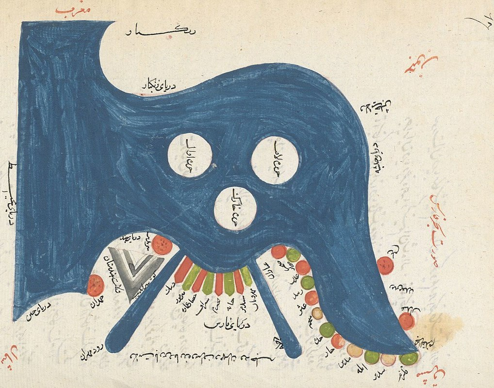
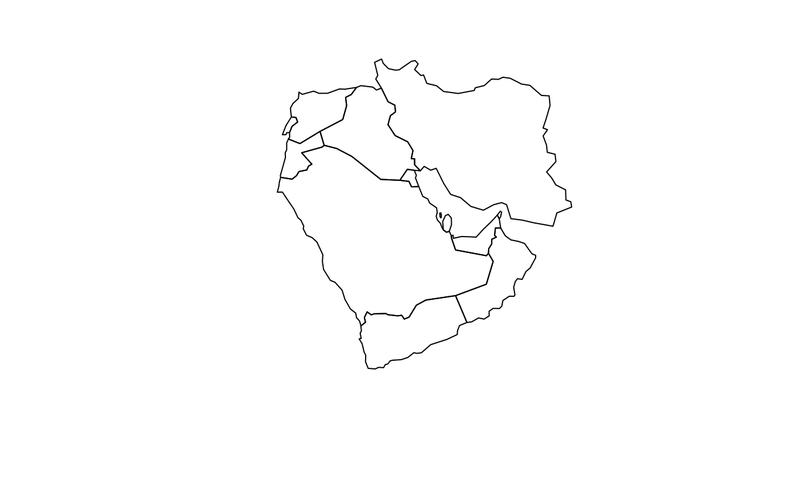
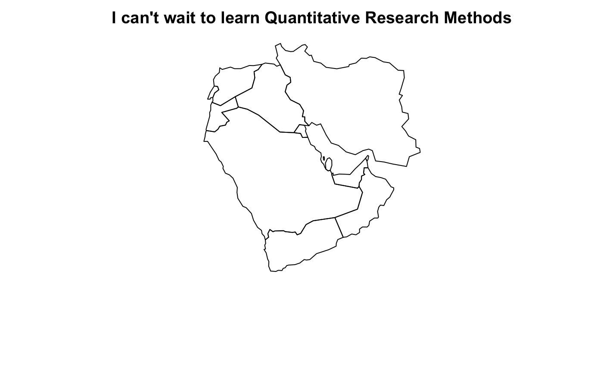

--- 
title: "MMES Quantitative Research Methods Oxford 2021"
author: "Christopher Barrie"
date: "`r Sys.Date()`"
site: bookdown::bookdown_site
output: bookdown::gitbook
documentclass: book
cover-image: "images/Bahre_Fars.jpeg"
bibliography: [book.bib, packages.bib]
biblio-style: apalike
link-citations: yes
github-repo: cjbarrie/bookdown_template
description: "This is a working version of MMES Quant. Methods materials book. The output format for this example is bookdown::gitbook."
---

# A note on this document {.unnumbered}

You will find contained in this online document all the materials you need for this course. The book sets out for each week the readings that we will be discussing for each of the four weekly seminars. It also contains a set of take-home exercises. You can read more about the structure of the course in the next Introduction section. Note: this is a "live" document, meaning that I will continue to tweak some things. But fear not, the main course materials and assigned readings will not change. 

```{r, echo=FALSE, out.width="100%", fig.align="center", fig.cap="Map of Persian Gulf, c.8-9 AH (c.14-15 AD). Source: https://gallica.bnf.fr"}

```


<!--chapter:end:index.Rmd-->

# Introduction {.unnumbered}

This course will provide you with an introduction to quantitative research methods in the study of the Middle East and North Africa (MENA). The course is *not* a comprehensive training in the technical aspects of quantitative research methods. What the course *will* provide is an introduction to what quantitative research looks like when applied to questions of substantive interest in the study of the MENA. 

For each week we will discuss several articles. The aim in setting these readings is to get you to be able to understand, articulate, and identify the underlying assumptions and structure of research employing quantitative techniques. This exercise will also help you develop an ability to criticize this research---from the perspective both of quantitative research design generally and Middle Eastern Studies specifically. Put another way, we will be discussing *both* the validity of a given research design generally *and* any problems arising from the application of such methods in a MENA context specifically. 

Finally, I will be asking you in take-home exercises to reproduce, using the <tt>R</tt> programming language, some of the data visualizations and findings from the articles we discuss each week. So, the aims of this course in brief, then:

- An ability to understand use the language of quantitative research design.
- An ability to understand and criticize the underlying assumptions and structure of a quantitative research design.
- An ability to reproduce the results of published research using the <tt>R</tt> programming language.

Each week the readings selected are aimed at the analysis of a different type of data. Here, I aim to convince you that large-N quantitative analyses can rely on diverse forms of data. In the last instance, however, what we are working with are quantitative information arranged in the form of a spreadsheet. In <tt>R</tt>, we usually refer to these spreadsheets as ``dataframes." These are, quite simply, sets of variables (vectors of numbers or words), stored as columns alongside each other. Nothing more, nothing less!

What we'll discover over the course of this module is that these data, while similar in appearance, permit us to answer an extremely diverse set of questions. We'll see this diversity in terms of the level of analysis (e.g., are we measuring things at the individual level, at the community level, or at the level of countries?); the types of measurement made (e.g., are we counting events, are we measuring sentiment in a set of texts, or are we asking people questions in surveys?); and the sources of the data itself (e.g., are we using search engine data, are we extracting information from maps, or are we analysing the content of social media users' Twitter feeds?).


## Structure of seminars {.unnumbered}

For each week, we will discuss several papers that use quantitative methods to answer questions relating to the MENA region. I set two or three of these each week. These articles **must be consulted in full** before each week's seminar. You can find these in the tabs for each week (if reading online) and the numbered chapters (if reading the pdf). The seminar will take the form of a discussion. I will take as much of a backseat as I deem appropriate. 

## Course content {.unnumbered}

Alongside these empirical case-study articles, I have set articles that discuss more general issues relating to the type of data or the empirical strategies used to analyse them. These articles are also to be consulted as they supply more general background to some of the questions tackled in the case-study material. We will not discuss these directly in the seminar but, if you want to have a better grasp of what the methods used in the case studies entail, you'd be minded to consult these.

Finally, for the more avaricious readers among you, I list further case studies that exploit the same sorts of data. These can be consulted at your leisure.

## Take-home assignments {.unnumbered}

For each week, I will also be supplying you with a take-home coding and analysis task to complete. These will be replication tasks based on the replication materials (data uploaded online for other researchers to check published results) supplied for one of the week's case-study articles. Four principal data sources are used for these, one for each corresponding week: 1) the SISI-SCIAT survey data used in the paper by @Truex2019; 2) protest event data from the 2011 Syrian Revolution used by @Mazur2019; 3) spatial data on the "Scramble for Africa" by @Michalopoulos2016; and 4) Search engine data from Saudi Arabia used by @Pan2020.

In the tabs to the left (if reading online) and in the second half of this document (if reading in pdf) you will be able to find these exercises. Before embarking on these, you should get acquainted with R and RStudio. You will be doing this in your labs with OSGA but I also supply some of the basic requirements to get you up and running in R in the section "Introduction to R."

You will do the exercises in your own time but I encourage you to begin on them as early as possible. You can send me your code attempts and I will look at them. You can also come to me with any questions you may have or bugs in need of fixing and I will do my best to help.

## A final word {.unnumbered}

One final disclaimer: the articles I'm asking you to read are accessible but difficult. They will challenge you and you won't understand everything in them or every last thing about the methods used in them. This is the case even for the more experienced practitioner (myself included). What I ask is that you engage with them, try to unpick the underlying assumptions of each article, try to discern what the methods entail, try to question and unpack the data sources used etc. You'll find a more thorough guide on how to read a quant. article [here](https://www.asanet.org/sites/default/files/savvy/introtosociology/Documents/MethodsDocuments/KrippnerReadingQuantArticle.html). In reading these articles together, assembling and disassembling their parts, we will be able to discuss several important questions that the quantitative researcher has to face. I include some of these in the seminar questions for each week. Doubtless, you will also come armed with your own.

I was a languages and literature (Arabic and French) student as an undergraduate. I never believed myself to be a "maths person" or a "stats person." What I therefore encourage you all to do is to approach new and less familiar topics as opportunities to develop and explore new ways of knowing, versus seeing e.g. quant. methods as something for which we "have" or "don't have" an innate ability. By doing so, we have a much better chance of getting on in a subject. The relevant buzzword for this is ``growth mindset"... and there is even a paper published in perhaps the most prestigious journal in the world---*Nature*--- showing it to work: see [here](https://www.nature.com/articles/s41586-019-1466-y). You can read more about this in your spare time. I'll leave it up to you to tell me whether I have grown into my role or not... 

<!--chapter:end:01-intro.Rmd-->

# Week 1: Surveys and experiments {.unnumbered}

Survey data is one of the most regularly used type of data---certainly when we're interested in measuring individual-level attitudes and preferences. But surveys are also how we measure unemployment, population, and migration etc. That is, we can use them to measure aggregate population-level characteristics too. And what we'll see in the readings for this week is that surveys can also be combined with experimental strategies for estimating the causal effect of given ``treatments" of interest. We will compare these to other experimental strategies for measuring real-world behaviours.

We will have the opportunity to discuss surveying techniques, more recent innovations in so-called "survey experiments" [@Nugent2020; @Bush2016; @Nugent2018], the potentials and pitfalls of survey techniques designed to overcome social desirability bias [@Truex2019; @Brooke2017a; @Nillesen2021], and experimental setups designed to measure real-world behavior [@Mousa2020]. 

For each of these empirical papers, I have selected some more general readings, and further case studies, pertinent to the issues raised in each. The papers by @Krumpal2013a and @Ksiazkiewicz2013 provide general overviews of issues of social desirability bias and so-called "implicit attitudes" techniques in social cognition research. The article by @Schuman1976 provides an early overview of the so-called attitude-behaviour gap in survey research, while the @Barabas2010 article investigates the external (i.e., real-world relevance) of lab-based experiments. The book by @Kuran1995b is a classic of social science research and should be consulted in part, if not in full by anyone with an interest in studying attitudes generally. The *World Politics* article by @Kuran1991a provides an accessible application of the theory of preference falsification to contexts of political revolution.

The aim of the practical exercise is to help you understand, analyse, and reproduce aggregate descriptive statistics. Here, we will be using data from a recent article in the *Journal of Politics* by @Truex2019 that investigates levels of support for the authoritarian government of Abdel Fattah El-Sisi in Egypt. The exercise will show you how to replicate their results in <tt>R</tt> and you will also be set some coding tasks to complete yourselves.

**Questions to consider in the seminar**: Can we rely on individuals to give honest answers? Can we accurately measure complex concepts in surveys? What criteria might we use to ensure the validity of survey instruments? Can we measure opinions without directly asking for them? How might we overcome response biases in survey research? Does experimental evidence tell us something meaningful about real-world social phenomena?

**Required reading**:

- @Mousa2020
- @Nugent2020
- @Truex2019

**General reading**:

- @Barabas2010
- @Ksiazkiewicz2013
- @Kuran1995b
- @Kuran1991a
- @Krumpal2013a
- @Schuman1976

**Additional case studies reading**:

- @Brooke2017a
- @Nugent2018
- @Bush2016
- @Nillesen2021


<!--chapter:end:02-week1.Rmd-->


# Week 2: Event data {.unnumbered}

Event data can take on a wide variety of different forms. This week, we will be reading several articles that each use one or other of these types of data. Events, as you will see, are very broadly defined. In the paper by @Bove2017, events take the form of international conflict events; in the article by @Mazur2019 they are protest events in the early stages of the Syrian Revolution. What is common across these literatures is a concern to explain systematically the occurrence of discrete events in time. Each of the papers has been selected to give you a flavour of what forms event data might take, as well as the potential benefits and pitfalls of their collection and use. 

The article by @Mazur2019 details the sources and techniques used for collecting event data, as well as the possible biases introduced by the use of these sources. The paper by @Earl2004 tackles questions related to the use of newspapers for studying collective action phenomena, while that by @Baum2015 engages a similar topic but asks questions specifically of the use of newspapers in non-democratic contexts. 

The paper by @Bove2017 takes up a question that has received outsized attention in Middle East studies: the clash of civilizations theory first proposed by Samuel P. Huntington in a *Foreign Affairs* article [here](https://www.foreignaffairs.com/articles/united-states/1993-06-01/clash-civilizations). This will give us the opportunity to engage questions of measurement validity in relation not only to the culture but also to conflict generally---questions taken up in the general readings by @Kalyvas2003, @Wedeen2002, and @Adcock2001. For those interested, you'll also find references to a back-and-forth between Huntington and the authors of a previous test of his conjecture listed in the further case studies [@Huntington2000; @Oneal2000; @Russett2000].

**Questions to consider in the seminar**: What issues need to be considered when categorizing events into discrete categories? What constitutes a valid sample from which to make population-based inferences? Are newspapers valid sources of data? Is information bias particularly acute in non-democracies? Can we accurately measure contentious and disruptive political phenomena (war, conflict, protest)? Can we measure culture?

**Required reading**:

- @Chiozza2002
- @Mazur2019

**General reading**:

- @Baum2015
- @Earl2004
- @Kalyvas2003
- @Wedeen2002

**Additional case studies reading**:

- @Huntington2000
- @Russett2000
- @Oneal2000

<!--chapter:end:03-week2.Rmd-->


# Week 3: Spatial data {.unnumbered}

This week we will be looking at a type of data that is becoming increasingly used---spatial data. Of course, all data is spatial in some sense: everything happens somewhere. But spatial data refers more specifically to how we might leverage geographical information to answer questions of interest about the social world. And some questions are more spatial than others....

Spatial data, we will see, is particularly relevant when we're thinking about questions of historical interest. When I first started learning quantitative methods, I was working under the assumption that large-N analysis was restricted to the study of topics of contemporary interest. After all, surveys weren't widely used until the second half of the Twentieth Century, and how could we possibly obtain systematic data on historical phenomena when modern social scientific methods hadn't yet been invented? Not only is historical data used in the quantitative literature, its use is becoming increasingly popular. 

Here, we will firstly look at a recent article by @Brooke2018 that uses so-called ``historical GIS" techniques (computational methods to geocode phenomena of interest and extract data from maps). This will give us the chance to discuss the potentials and pitfalls of historical-GIS techniques, questions relating to appropriate units of analysis [@Branch2016], as well as classic problems in spatial analysis relating to the ecological fallacy [@Robinson1950].

The article by @Michalopoulos2016 looks at a particular historical event of interest---the "Scramble for Africa"---but does so to make claims about the effects of colonialism on present-day economic development. This literature is more broadly known as "persistence" scholarship, in reference to the persistent long-run effects of events in time. Such claims, and forms of analysis, naturally give rise to questions concerning causality and historical process; questions that are taken up in the article by @Kocher2016. An additional article in the further reading by @Michalopoulos2018 also uses spatial data to investigate the link between pre-Islamic trade routes and present-day levels of adherence to Islam. 

A final article by @Blaydes2019 takes up a question of central interest in the literature on comparative Middle Eastern development: divergence in relation to European economies. The additional reading by @Blaydes2020 looks specifically at the effect of political conflict on long-run development. These articles give us the chance to scrutinize the spatial techniques used, and to think about some of the many competing explanations for comparative Middle Eastern development, some of which even stretch back to the Neolithic Period [@Olsson2016]!

**Questions to consider in the seminar**: Can we infer individual-level characteristics/behaviour from aggregate statistics? Why might ecological inferences differ from individual-level inferences? What can we measure from maps and what can we not measure? By what criteria should we assess the validity of so-called "persistence" arguments? What version of causality is promoted by this literature? 

**Required reading**:

- @Brooke2018
- @Michalopoulos2016
- @Blaydes2019

**General reading**:

- @Branch2016
- @Kocher2016
- @Robinson1950
- @Blaydes2017

**Additional case studies reading**:

- @Olsson2016
- @Blaydes2020
- @Michalopoulos2018

<!--chapter:end:04-week3.Rmd-->


# Week 4: Online and text data {.unnumbered}

For the final week, we will be looking at another type of data that is becoming increasingly commonly used (especially given the growing availability of large text corpuses on Twitter, Facebook, Google Books etc.). This is text data. Increasingly, these data come from online sources and are being used to answer questions of social scientific relevance. When online and other digitally sourced data are repurposed to these ends, we often refer to them more generally as "digital trace" data. For an effective review of recent trends in this fast moving domain, see the articles by @Lazer2020b and @Edelmann2020. For a brilliant book-length introduction to this new domain of social research, look no further than the book by @Salganik2018.

We will be looking at two main case study articles. The first, by @Nielsen2019, does not involve much online material but does take its source material from a set of texts sourced online from Salafi preachers to argue that social movements, even the more patriarchal among them, might make use of female preachers for pragmatic reasons. 

The paper by @Pan2020 makes use of Twitter data to gauge the impact of repression on online behaviour in Saudi Arabia. For both papers, it is worth considering questions of sample selection, language translation, and the accuracy of some forms of unsupervised machine learning techniques. These are discussed in the three general readings by @Grimmer2013, @DiMaggio2015, and @Lucas2015.

The further readings by @Siegel2020a and @Kubinec2021 demonstrate how we construct pretty elaborate research designs from these online materials. Indeed, coming back full circle, we see that we are able effectively to recreate an experimental setting using online data and effectively measure attitudes using digital trace data alone. 

We will also be able to use a portion of this week and my office hours afterward to discuss any questions or concerns you may have regarding the assessment.

**Questions to consider in the seminar**: Does social media data constitute a valid sample? How do we verify the validity of our sample when it comes to text data more generally? What types of inferences can we make from these datasets? Can we rely on the automatic coding of text data? How might text data be useful for questions of historical and social scientific interest?


**Required reading**:

- @Nielsen2019
- @Pan2020

**General reading**:

- @DiMaggio2015
- @Edelmann2020
- @Grimmer2013
- @Lazer2020b
- @Lucas2015
- @Salganik2018

**Additional case studies reading**:

- @Siegel2020a
- @Kubinec2021

<!--chapter:end:05-week4.Rmd-->

# Introduction to R {.unnumbered}

## Introduction {.unnumbered}

This section is designed to ensure you are familiar with the <tt>R</tt> environment. It also provides guidelines on how to use the Swirl package in <tt>R</tt>: a built-in tutorial that familiarizes users with basic <tt>R</tt> commands. I thank Julia de Romémont for sharing an earlier version of this introductory section. 

## Getting started with R at home {.unnumbered}

Given that we're all working from home these days, you'll need to download R and RStudio onto your own devices. R is the name of the programming language that we'll be using for coding exercises; RStudio is the IDE ("Integrated Development Environment"), i.e., the piece of software that almost everyone uses when working in R. 

You can download both of these on Windows and Mac easily and for free. This is one of the first reasons to use an "open-source" programming language: it's free! And this means everyone has access to it. 

1. Install R for Mac from here: https://cran.r-project.org/bin/macosx/. Install R for Windows from here: https://cran.r-project.org/bin/windows/base/.

2. Download RStudio for Windows or Mac from here: https://rstudio.com/products/rstudio/download/, choosing the Free version: this is what most people use and is more than enough for all of our needs.

**All programs are free. Make sure to load everything listed above for your operating system or R will not work properly!**

## Some basic information {.unnumbered}

+ A script is a text file in which you write your commands (code) and comments.

+ If you put the <tt>#</tt> character in front of a line of text this line will not be executed; this is useful to add comments to your script!

+ <tt>R</tt> is case sensitive, so be careful when typing. 

+ To send code from the script to the console, highlight the relevant line of code in your script and click on <tt>Run</tt>, or select the line and hit <tt>ctrl+enter</tt> on PCR or <tt>cmd+enter</tt> on Mac

+ Access help files for <tt>R</tt> functions by preceding the name of the function with <tt>?</tt> (e.g., <tt>?table</tt>)

+ By pressing the <tt>up</tt> key, you can go back to the commands you have used before

+ Press the <tt>tab</tt> key to auto-complete variable names and commands

## Getting Started in RStudio {.unnumbered}

Begin by opening RStudio (located on the desktop). Your first task is to create a new script (this is where we will write our commands). To do so, click: 

```{r eval=FALSE}
File --> NewFile --> RScript
```

Your screen should now have four panes:

+ the Script (top left)

+ the Console (bottom left)

+ the Environment/History (top right)

+ Files/Plots/Packages/Help/Viewer (bottom right)

## A simple example {.unnumbered}

The Script (top left) is where we write our commands for R. You can try this out for a first time by writing a small snipped of code as follows:

```{r, eval=TRUE}

x <- "I can't wait to learn Quantitative Research Methods" #Note the quotation marks!

```
To tell R to run the command, highlight the relevant row in your script and click the <tt>Run</tt> button (top right of the Script) - or hold down <tt>ctrl+enter</tt> on Windows or <tt>cmd+enter</tt> on Mac - to send the command to the Console (bottom left), where the actual evaluation and calculations are taking place. These shortcut keys will become very familiar to you very quickly!

Running the command above creates an object named ‘x’, that contains the words of your message.

You can now see ‘x’ in the Environment (top right). To view what is contained in x, type in the Console (bottom left):
```{r eval=TRUE}

print(x)

# or alternatively you can just type:

x

```

## Loading packages {.unnumbered}
The 'base' version of <tt>R</tt> is very powerful but it will not be able to do everything on its own, at least not with ease. For more technical or specialized forms of analysis, we will need to load new packages. 

This is when we will need to install a so-called ‘package’---a program that includes new tools (i.e., functions) to carry out specific tasks. You can think of them as 'extensions' enhancing <tt>R</tt>'s capacities. To take one example, we might want to do something a little more exciting than print how excited we are about this course. Let's make a map instead.

This might sound technical. But the beauty of the packaged extensions of <tt>R</tt> is that they contain functions to perform specialized types of analysis with ease. We'll first need to install one of these packages, which you can do as below:

```{r, eval=FALSE}
install.packages("rworldmap")
```

You can load the most recent version of packages using RStudio (by clicking <tt>Install</tt> under the packages tab of the bottom right pane and typing the name of your desired package) and ensuring the top drop down menu says install from Repository (CRAN). Keep <tt>Install dependencies</tt> ticked.

After the package is installed, we then need to load it into our environment by typing <tt>library(<insert name of package here>)</tt>. Note that, here, you don't need to wrap the name of the package in quotation marks. So this will do the trick:

```{r, eval=F}
library(rworldmap)
worldmap <- getMap()
```

What now? Well, we could have a look through what this package can do by typing `vignette("rworldmap")`, which will guide you through what is contained in this package. Alternatively, you can go straight ahead and plot your first map. 

```{r, eval=F}
plot(worldmap[which(worldmap$GLOCAF=="Middle East"),])
```
```{r, echo=FALSE, out.width="100%", fig.align="center"}

```


And we might then want to add a title to this map. Remember we stored our first message to ourselves as "x" above, and this is just a string of words, or a "character" object. We can add this to our map with ease, as below:

```{r, eval=F}
plot(worldmap[which(worldmap$GLOCAF=="Middle East"),],
     main = x)
```
```{r, echo=FALSE, out.width="100%", fig.align="center"}

```


If we wanted to save where we'd got to with plotting the Middle East on a map, we would want to save our scripts, and maybe the data we used as well, so that we could return to it at a later stage.

## Saving your objects, plots and scripts {.unnumbered}

* Saving scripts: To save your script in RStudio (i.e. the top left panel), all you need to do is click File –> Save As (and choose a name for your script). Your script will be something like: myfilename.R.

* Saving plots: If you have made any plots you would like to save, click Export (in the plotting pane) and choose a relevant file extension (e.g. .png, .pdf, etc.) and size.

+ To save **individual** objects (for example <tt>x</tt> from above) from your environment, run the following command (choosing a suitable filename): 

```{r, eval=FALSE}
save(x,file="myobject.RData")
load(file="myobject.RData")
```
      
+ To save **all** of your objects (i.e. everything in the top right panel) at once, run the following command (choosing a suitable filename):

```{r, eval=FALSE}
save.image(file="myfilname.RData")
```

+ Your objects can be re-loaded into R during your next session by running:

```{r, eval=FALSE}
load(file="myfilename.RData")
```

## Knowing where R saves your documents {.unnumbered}

If you are at home, when you open a new script make sure to check and set your working directory (i.e. the folder where the files you create will be saved). To check your working directory use the getwd() command (type it into the Console or write it in your script in the Source Editor):

```{r, eval=FALSE}
getwd()
```

To set your working directory, run the following command, substituting the file directory of your choice. Remember that anything following the `#’ symbol is simply a clarifying comment and R will not process it.

```{r, eval=FALSE}
## Example for Mac 
setwd("/Users/Documents/mydir/") 
## Example for PC 
setwd("c:/docs/mydir") 
```

## Practicing in R {.unnumbered}

You're going to have your own lab tutorials in <tt>R</tt> and so this is not the appropriate place to teach you everything about the programming language. This course is principally designed to get you thinking about quantitative research methods. What I recommend that **all** of you do, though, before we begin our classes is to familiarize yourself with some of the basics of <tt>R</tt> in your own time.

The best places to start doing this are:

- The free online book by Hadley Wickham "R for Data Science" available [here](https://r4ds.had.co.nz/)

- A set of interactive tutorials, available through the package "learnr." Once you've installed this package, you can go through the tutorials yourselves by calling:

```{r, eval = F}
library(learnr)

available_tutorials() # this will tell you the names of the tutorials available

run_tutorial(name = "ex-data-basics", package = "learnr") #this will launch the interactive tutorial in a new Internet browser window

```

## One final note {.unnumbered}

Once you've dipped into the "R for Data Science" book you'll hear a lot about the so-called <tt>tidyverse</tt> in R. This is essentially a set of packages that use an alternative, and more intuitive, way of interacting with data. The main difference you'll notice here is that, instead of having separate lines for each function we want to run, sets of functions are "piped" into each other using "pipe" functions, which look have the appearance: `%>%`. 

In the first set of weekly exercises I will provide code in both the base R way, which you will predominantly use for your stats. tutorials. From Week One onwards I will only be using <tt>tidyverse</tt> syntax. It is worth getting used to this syntax because it has recently been incorporated into base R functionality, meaning it will likely become the norm from now on.

<!--chapter:end:06-Rintro.Rmd-->


# Week 1 Exercise {.unnumbered}

## Investigating support for Sisi in Egypt {.unnumbered}

We are now ready to tackle a real world example from one of the readings for this week---the [article](https://www.journals.uchicago.edu/doi/abs/10.1086/703209?mobileUi=0) by Rory Truex and Daniel L. Tavana investigating support for Sisi in Egypt using implicit attitudes methods. Below, we will use the same data as used in the article. The full replication data and Questionnaire can be located [here](https://dataverse.harvard.edu/dataset.xhtml?persistentId=doi:10.7910/DVN/OFK4L6). However, in the exercise below, we will be using, to begin with, a simplified dataset containing a subset of these data, which I have prepared for the purposes of this exercise.

## Preparing the dataset {.unnumbered}

The simplified dataset can be found on my GitHub page [here](https://github.com/cjbarrie/teaching_material). The table below displays the variables included in the dataset. Search through these to get acquainted with how each item is measured.

Our first task is to read in the data from the url to my Github page. The dataset contains a number of variables. To begin with we're going to work with just seven of these. To create a shorter version of these data including only the variables (columns) we want, we can use the <tt>tidyverse</tt> command types, which utilize "pipe" functions--- %>% --- to select the variables we want. In base R we could do the same thing. Both approaches to subsetting the data and generating a new dataframe are described below. 

For more practice on the <tt>tidyverse</tt>, look no further than  [R for Data Scien ce](https://r4ds.had.co.nz/), which is available free online. In coming weeks, I will only be using <tt>tidyverse</tt> syntax so it is worth getting used to!

```{r, eval=T, verbose=F, warning=F}
library(tidyverse)
library(patchwork)

dat <- read.csv("https://raw.githubusercontent.com/cjbarrie/teaching_material/master/sisi_data.csv")

#tidyverse way:

sisi_data <- dat %>%
  select(STIAT.test, approve_abdel_rev, edu,
         gender, income,
         location, region)

#base R way:

myvars <- c("STIAT.test", "approve_abdel_rev", 
            "edu", "gender", "income", "location", 
            "region")
sisi_data <- dat[myvars]

```

The table below provides an overview of these data and what they are measuring.


Number | Variable Name | Description
----------------- | -------------- | ---------------------------------------------------------
[1] | STIAT.test | IAT "D-"score
[2] | approve_abdel_rev | Explicit SISI approval rating
[3] | edu | Education (1-6 scale: 1=Elementary; 6=MA and above)
[4] | gender | Gender (1=male/2=female)
[5] | income | Income (1-11 scale: 1= Less than 500 LE; 11= More than 10,000 LE)
[6] | location | Province in which respondent lives

Now let's look at how each of these variables is stored in R.

```{r, echo=F, verbose=F, message=F}
str(sisi_data)
```

The first variable in our dataframe is *STIAT.test*. This is the main outcome variable---the D-score---from the IAT procedure used in the article by Truex and Tavana. We can see that this variable is stored as a numeric data type. We can compare this to other data types in the variables column. For example, *edu* is stored as an integer. This is because *edu* is a categorical variable coded at increasing integer values on a 1-6 scale.

There are six main data types, which are:

1. int: integers
2. dbl: doubles (i.e., real numbers)
3. chr: character vectors, or strings (i.e., words or sequences of letters)
4. lgl: logical, can take values TRUE or FALSE
5. fctr: factors, which are categorical variables with fixed possible values
6. date: dates

## Visualizing the data {.unnumbered}

Using *STIAT.test* we can easily reproduce the graph from Figure 3 in the paper. Figure 3 is simply a histogram representing the distribution of this variable. Recall that positive scores indicate more favourable attitudes toward Sisi. 

```{r, eval = T}
hist(sisi_data$STIAT.test)
```

With a bit of help from the <tt>ggplot2</tt> package, we can get our graph to look like the published figure in the paper. This package is used by a large number of practitioners in R. It departs somewhat from the logic of the base R language---which you will be more used to---but is arguably more intuitive. The best intro. to data visualization with <tt>ggplot2</tt> can be found [here](https://r4ds.had.co.nz/data-visualisation.html). Another very good tutorial on <tt>ggplot2</tt>, and one which explains the key differences to visualization in base R, can be found [here](https://tutorials.iq.harvard.edu/R/Rgraphics/Rgraphics.html).

Let's walk through this code step by step to better understand what <tt>ggplot2</tt> is doing here. <tt>ggplot</tt> commands basically just tell R first what dataframe we're using; i.e., `ggplot(data = sisi_data,` and after the comma we have a section where we specify our "aesthetic mappings" (or `aes`). In other words, this is where we tell R what we want on the x- and y-axis. Given that this is a histogram, we don't have to specify the y-axis because we know that this will simply be a frequency mapping of whatever the x-axis variable is (a histogram is simply a graph of relative frequencies of the x-axis variable over the range of its observed values). We specify on the x- (horizontal) axis, then, STIAT.test, which is the variable measuring implicit attitudes toward Sisi. We then specify what type of graph we want. Here, we select `geom_histogram` as we want a histogram of the frequencies of each "bin" of this variable. We specify how many of these breaks we want with the argument `bins=52`. This simply means breaks should run from -1.3 to 1.3 with .05 increments. Why have I chosen this? Well, since our variable runs from -1.3 to 1.3, the range of the variable is 2.6 (1.3+1.3). If we divide 2.6 by .05, we get a nice round number of 52, which effectively visualizes the frequency distribution of this variable. Everything after this is included just to change the colours and theme (i.e., styling) of the graph. You can play around with this and see what happens.

```{r, eval = T}
ggplot(data=sisi_data, aes(x=STIAT.test)) + 
  geom_histogram(bins=52, 
                 col="grey30",fill="white",
                 alpha = .75) + theme_bw()
```

Try running this code but change the number of bins we are using. Make sure you understand what is happening to these data when you do this. We can also subset these data by male and female to compare the relative distributions of scores. What do we see here?

```{r, eval = T}
##tidyverse "piping" way to subset and visualize together
g1 <- sisi_data %>%
  filter(gender==1) %>% # male ==1 in this dataset
ggplot(aes(x=STIAT.test)) + 
  geom_histogram(bins=52, 
                 col="grey30",fill="white",
                 alpha = .75) + theme_bw() +
  ggtitle("Male")

g2 <- sisi_data %>%
  filter(gender==2) %>%
ggplot(aes(x=STIAT.test)) + 
  geom_histogram(bins=52, 
                 col="grey30",fill="white",
                 alpha = .75) + theme_bw() +
  ggtitle("Female")

g1 + g2

##base R way: subsetting data then plotting

sisi_data_male <- subset(sisi_data, gender==1)
sisi_data_female <- subset(sisi_data, gender==2)

par(mfrow=c(1,2)) #specify visualization params.
hist(sisi_data_male$STIAT.test, 
     xlim=c(-1.3, 1.3), breaks = 52, main="Male")
hist(sisi_data_female$STIAT.test, 
     xlim=c(-1.3, 1.3), breaks = 52, main="Female")

```

## Subsetting the data {.unnumbered}

What can we tell from this? Our sample is heavily male, as becomes clear from the frequencies displayed in the histogram. The mean of both samples is nonetheless pretty similar at around .05. To calculate the mean across both genders in R, we can run the following lines of code:

```{r}
male <- subset(sisi_data$STIAT.test,sisi_data$gender==1)
female <- subset(sisi_data$STIAT.test,sisi_data$gender==2)

mean(male)
mean(female)

#alternatively  use tapply:
tapply(sisi_data$STIAT.test, 
       sisi_data$gender, mean)
```

```{r}
#the tidyverse way:
#mean for males:
sisi_data %>%
  filter(gender==1) %>%
  summarise(mean(STIAT.test))

#mean for females:
sisi_data %>%
  filter(gender==2) %>%
  summarise(mean(STIAT.test))

```

In this paper about attitudes toward Sisi, the authors argue that we can find evidence of attitude dissociation. They make this inference, in a first stage, on the basis of a weak correlation between respondents' answers to a question directly probing support for Sisi and the implicit attitudes questions that aims to uncover undisclosed or 'implicit' attitudes. The relevant variable for the direct support measure is named 'approve_abdel_rev' in this dataset and it's measured on a 1-4 scale. These variables names aren't particularly intuitive. Let's rename them something more informative for the purposes of the exercises that follow. We'll call the direct support question *direct_sup* and the indirect, or "implicit", support question *indirect_sup*. The code to this, in both tidyverse and base R, is below.

```{r, eval=F}
#the base R way:
names(sisi_data)[names(sisi_data) == "approve_abdel_rev"] <- "direct_sup"
names(sisi_data)[names(sisi_data) == "STIAT.test"] <- "indirect_sup"
```

```{r, message=F, verbose=F, warning=F}
#the tidyverse way:
sisi_data <- sisi_data %>% 
  rename(direct_sup = approve_abdel_rev,
    indirect_sup = STIAT.test)
```

We can recreate their scatter plot in Figure 6 with the following lines of code, again in ggplot.

```{r, eval=T, verbose=F, warning=F}
ggplot(sisi_data, aes(x=indirect_sup, y=direct_sup)) +
  geom_jitter(color="darkblue", alpha=.25,
              size=1.25, width=.5, height=1.25) +
  geom_smooth(method=lm, se=FALSE, colour="black") + 
  xlab("Implicit Attitudes Towards Sisi") + 
  ylab("Explicit Attitudes Towards Sisi") +
  theme_bw()
```

Does this pattern of dissociation hold across all regions in the sample? To check this we can use the 'facet_wrap' function that is part of ggplot. To use this, we simply specify a variable in the dataframe by which we wish to 'facet' our visualization. In essence, what we are doing here is running the same lines of code for subsets of the dataframe. Each subset in this case will be the data for a particular region. 

```{r, eval = T, message=F, warning=F}

ggplot(sisi_data, aes(x=indirect_sup, y=direct_sup)) +
  geom_jitter(color="darkblue", alpha=.25,
              size=1.25, width=.5, height=1.25) +
  geom_smooth(method=lm, se=FALSE, colour="black") + 
  xlab("Implicit Attitudes Towards Sisi") + 
  ylab("Explicit Attitudes Towards Sisi") +
  facet_wrap(~region) +
  theme_bw()

#it is a lot less intuitive to do this in base R:

regions <- sort(unique(sisi_data$region))
par(mfrow=c(2,3))
for (i in seq_along(regions)) {
  regst <- regions[i]
  dat <- subset(sisi_data, region==regst)
  plot(jitter(dat$direct_sup,2) ~ dat$indirect_sup, 
       main=regst,
     xlab = "Implicit Attitudes Towards Sisi", 
     ylab = "Explicit Attitudes Towards Sisi")
  abline(lm(dat$direct_sup ~ dat$indirect_sup, 
            data = dat), col = "blue", pch=3)
}
```

What can we conclude after subsetting the data like this. Do the correlations like similar across regions?

## Coding tasks {.unnumbered}

- What is the the correlation between the implicit Sisi attitudes ('SIAS.test') and explicit Sisi attitudes item ('approve_abdel_rev') for each region of Egypt? The relevent function to compute a correlation coefficient in R is 'cor()'. Hint: you should subset the data by region.
- Calculate the percentage of Christian and Muslim respondents who exhibit "classic dissociation" in this sample.
- Create scatterplots of explicit and implicit support for Sisi for the Christian and Muslim subsets of the data.

<!--chapter:end:07-week1ex.Rmd-->


# Week 2 Exercise {.unnumbered}

## Analysing protest in the Syrian Revolution {.unnumbered}

This week we are analysing event data. Event data takes multiple forms, as we saw from the readings this week. Often, it takes the form of so-called "event catalogues". See [this article](https://journals.sagepub.com/doi/10.1111/1467-9558.00161) by Charles Tilly for an overview of their use and some theoretical reflections on what they can teach us. The data we will be using this week comes from a recently published [article](https://journals.sagepub.com/doi/abs/10.1177/0010414018806536?journalCode=cpsa) by Kevin Mazur on the patterns of protest (or "challenge") seen during the early stages of the 2011 Syrian Uprising. The original replication materials can be found [here](https://journals.sagepub.com/doi/suppl/10.1177/0010414018806536). Download them from here if you want to get all of the files. Alternatively, you can download them from my GitHub page as below.

## Read in the data {.unnumbered}

```{r}
library(tidyverse)
library(ggthemes)
library(tsibble)
library(sf)

syr_data <- read.csv("https://raw.githubusercontent.com/cjbarrie/teaching_material/50588a5f9ae7f1a3a343c7bdcef8df7acd8f38c3/event_db.csv",
                        stringsAsFactors=F)
```

Let's start by viewing the dataset. We can see that it contains information on the challenge events in the early stages of the Syrian Revolution described by Mazur in the case study [article](https://journals.sagepub.com/doi/abs/10.1177/0010414018806536?journalCode=cpsa) we looked at for this week.

```{r, eval=FALSE}
View(syr_data)
```

And then we'll check to see how each variable is stored:

```{r}
str(syr_data)
```

## Time-series plots {.unnumbered}

We can see that it contains columns on the type of challenge events seen over time as well as the locations and dates of their occurrence. We will first create a 'time series' plot of events over time. Like last week, we first wrangle the data into an appropriate format for visualizing it in this way. 

Since each row represents an event, we first create a variable, which we'll name *event* and that records solely so-called "challenger" events (as opposed to regime repression events, which are also included in the dataset). The code to do this requires us to name a new variable in the original event dataset and sum together two columns in the event dataset named *ch_pcfl* and *ch_sviol*, which contain 1s and 0s denoting whether the challenge event was peaceful or violent. 

```{r, eval=TRUE}
syr_data$event <- syr_data$ch_pcfl + syr_data$ch_sviol
```

As with the survey data we studied last week, we can then wrangle and reshape this data into a format suitable for a timeseries plot (essentially a graph of events over time). For this, we need to know first the number of events witnessed per day. We can see in the dataset that the date is recorded in yyyy-mm-dd format. This makes conversion to an R-readable date pretty straightforward. For more practice on working with dates in R, see this [online tutorial](https://campus.datacamp.com/courses/intermediate-r-for-finance/dates?ex=6). To make sure this date is readable in R, we simply type:

```{r, eval=TRUE, message=FALSE, warning=FALSE}
syr_data$date <- as.Date(syr_data$date)
```

To make sure these have converted properly we can have a glimpse at the data using the `glimpse()` function, which is part of the <tt>tidyverse</tt> package.

```{r, eval=TRUE, message=FALSE, warning=FALSE}
glimpse(syr_data$date)
```

As in weeks past, all we are doing here is passing an existing object---the vector (i.e., column) of dates---through a function, this time called `as.Date` (a function from base R; i.e., you don't need any extra packages to run this command), which translates the date into R-readable format. 

We can then begin to wrangle the data into a format appropriate for visualizing timeseries data. In the below, we subset the original event dataset, summing the events by date to arrive at a daily count of challenge events. 

```{r, message=FALSE, warning=FALSE}
# get events by date using tidyverse:

syr_events_ts <-  syr_data %>%
  group_by(date) %>%
  summarize(sum_event = sum(event))
```

## Using the <tt>tidyverse</tt> {.unnumbered}

Here, we're using so-called "pipe operators". You have already encountered the subsetting function `subset()` in your labs. We also used these once or twice in the coding sheets last week. The `tidyverse` is essentially a more intuitive way of reshaping data. I basically only use this for wrangling (reshaping) data. For a good tutorial showing its potential for this, see this [page](https://jules32.github.io/2016-07-12-Oxford/dplyr_tidyr/). Basically pipe operators "pipe" (or pass on) what is on the left-hand side to what is on the right, and so on in turn. In this respect, it is a more intuitive way to reshape data than the methods provided in base R. So what are we doing here? The first part of this code `syr_events_ts` simply names the new subset of data we're creating. To this we're passing (with the <- operator) the already imported `syr_data` dataframe. But instead of just passing this object, we're telling R to reshape it (the code on the right-hand side after the pipes) before passing it back to our new `syr_events_ts` dataframe. Here, we're saying: take `syr_data`, group that data by by date `(group_by(date)`, then sum the events by date `summarize(sum_event = sum(event))`. Then this is all passed back to (stored as) the object `syr_events_ts`. Have a look at the new dataframe by typing`View(syr_events_ts)`. You'll see that it shows a series of dates alongside the summed event values.

We can then plot a timeseries of challenge events by date using the <tt>ggplot2</tt> package that we used last week. Note that we're using here the `theme_tufte()` styling option that comes with the <tt>ggthemes</tt> package. This is solely to make the graph look nicer!

```{r}
ggplot(data = syr_events_ts, 
       aes(x=date, y = sum_event)) +
  geom_bar(stat = "identity") + 
  theme_tufte(base_family= "Helvetica") +
  labs(title = "Syria challenge events 2011-2012",
       subtitle = "Data from Mazur (2018)",
       y = "# Challenge events",
       x = "Date")
```

## Using <tt>ggplot</tt> {.unnumbered}

So what's going on here? <tt>ggplot</tt> commands basically just require you first to specify what dataframe we're using; i.e., `ggplot(syr_events_ts,` and after the comma we have a section where we specify our "aesthetic mappings" (or `aes`). In other words, this is where we specify what we want on the x- and y-axis. Given that this is a timeseries plot, we have date on the x- (horizontal) axis and the sum of events on the y-axis. We then specify what type of graph we want. Here, we select `geom_line` as we want a line connecting the value of observations over time. Everything after `geom_line` is included just to specify labels and the theme (i.e., styling) of the graph. Remove this and see what happens. For graphs like this, in other words, we could have used only the following code:

```{r, eval=FALSE}
ggplot(data = syr_events_ts, 
       aes(x=date, y = sum_event)) +
  geom_line()
```

A ggplot of this sort is composed of only two parenthetical elements, then. The first specifies what the data is and what is to be plotted. The second specifies type of graph. Here, we're plotting with `geom_line` though we could also plot with `geom_bar` or `geom_area`. Try plotting with these different arguments and see which one gives the best visualization. Note: for reasons that are bit involved and you don't need to worry out, when specifying `geom_area` and `geom_bar` you also need to add the `stat = "identity"` argument. 

## Working with dates {.unnumbered}

We might also want to look into the patterning of violent and peaceful events over time. To facilitate interpretation, we'll first aggregate over a higher level of temporal aggregation and sum events by week. We can do this with the package <tt>tsibble</tt> (for more information on this package and another package--<tt>lubridate</tt>--useful for reshaping timeseries data, see [these](https://cran.rstudio.com/web/packages/tsibble/vignettes/intro-tsibble.html) [pages](https://lubridate.tidyverse.org/)).

Before doing that, we need to generate a categorical variable that records whether or not the event in question is a peaceful or violent challenge event. For a good tutorial on recoding variables, see [this page](http://rprogramming.net/recode-data-in-r/).

```{r, message=FALSE, warning=FALSE}
#generate categorical var. for event type:

syr_data$event_type[syr_data$ch_pcfl==1]  <- "Peaceful"
syr_data$event_type[syr_data$ch_sviol==1]  <- "Violent"

#generate timeseries data aggregated to date:
syr_events_ts <-  syr_data %>%
  group_by(event_type, date) %>%
  summarize(sum_event = sum(event))

```

Have a look at the new dataframe `syr_events_ts` and see how it is structured. Make sure it is clear in your mind how observations are being summed and grouped.

Next up we generate our "year-week" variable. Since events run over more than one year, we cannot just generate a week variable (i.e., taking values 1-52) as we will have the same number week repeated over multiple years. Summing over these weeks together would be nonsensical. Instead, we combine the week and year to make sure that we sum over e.g., week 12 of 2011 and not week 12 of 2011 and 2012. 

```{r, message=FALSE, warning=FALSE}
# generate year-week column
syr_events_ts$yrweek <- yearweek(syr_events_ts$date)

# group again by year-week
syr_events_ts_week <-  syr_events_ts %>%
  group_by(event_type, yrweek) %>%
  summarize(sum_event = sum(sum_event))
```

Have a look at the dataframe `syr_events_ts` to see what the *yrweek* variable looks like. 

Note that when we plot this data we specify `na.omit()` before the name of the data we're plotting in order to remove missing observations. We also add the `facet_grid` argument to tell R to plot over a 'facet' (separate graph on same plot). In other contexts, we might facet by date, by location or otherwise. Here, we're facetting by event type, which comes after a ~ (tilde) sign. 

You'll notice as well that we've added  `fill = event_type` to the aesthetic (`aes`) components of our plot. This just means that each event type will have a different color associated with it. Try adding and removing components in the plot to work out which parts are responsible for which elements of the graph. Try also changing the fill option to `shape` and see what results. You'll find a great website to use when selecting hex colours [here](https://htmlcolorcodes.com/).

```{r}
ggplot(data = na.omit(syr_events_ts_week),
       aes(x = yrweek, y = sum_event, 
           fill = event_type)) +
  geom_bar(stat="identity") +
  facet_wrap(~ event_type) +
  theme_tufte(base_family = "Helvetica") +
  scale_fill_manual(values = c("#007A3D", "#CE1126")) +
  labs(fill="Event type", x="Date", y="# Events")

```

It might, however, be more informative to plot these two graphs on top of each other. This is achieved very straightforwardly. All we need to do, instead of facetting, is to add a 'fill' argument and to use event type as the variable by which we're filling. The graphs will then be plotted on top of eachother.

```{r}
ggplot(data = na.omit(syr_events_ts_week),
       mapping = aes(x = yrweek, y = sum_event, 
                     fill = event_type)) +
  geom_bar(stat = "identity", alpha=1) +
  theme_tufte(base_family = "Helvetica") + 
  scale_fill_manual(values = c("#007A3D", "#CE1126")) +
  labs(x="Date", y="# Events", fill="Event type")

```

## Visualizing data on maps: {.unnumbered}

**Disclaimer**: in previous years, this section was deemed a bit too advanced. I really urge you to give this a go though: especially as we are going to be talking about, and working with, spatial data next week. On the surface, mapping spatial data looks challenging. But in essence we are just doing similar things here to what we've done above and in the previous week. The difficulty comes in the forms of data used (shapefiles are notoriously messy) and in joining together ("merging") different forms of data. Give it a go! And don't be dissuaded if this proves too difficult at this stage. That's what my office hours are for :) 

There are several excellent resources you can use to learn more about mapping in R. The first and best is Robin Lovelace's book *Geocomputation with R*, which he has made freely available [here](https://geocompr.robinlovelace.net/adv-map.html). 

All we need to plot a map when using this sort of data is to go through three easy steps. We first need to identify the unit over which we're mapping; i.e., are we mapping over districts, governorates, provinces etc.? In the below, we are mapping over each of the fourteen governorates of Syria. 

We next need to obtain what is known as a 'shapefile'. This is simply the format of file (overly complicated and in need of reforming) most commonly used to store GIS data. In this example, it is a set of polygons with associated coordinates that map out the governorates of Syria. But you don't need to worry too much about the complexities of how this data is stored. We can download shapefiles from several places. Here, I use the [Humanitarian Data Exchange](https://data.humdata.org/dataset/syrian-arab-republic-administrative-boundaries-populated-places) but [diva-gis](http://www.diva-gis.org/gdata) is also a good place to look.

For the purposes of this exercise you can download the shapefiles I use from my GitHub page [here](https://github.com/cjbarrie/teaching_material), making sure to download all of the syr_admin1 files with different file extensions (shapefiles come in multiple parts even though we only end up actually reading in the .shp file...). 

You then need to make sure, once you've downloaded them, that they're in your "working directory" when you read them from the RStudio Console. You can do this with the `setwd()` function. We read in the shapefile with a command included in the <tt>sf</tt> package.

```{r, eval=F}
syr_shp <- st_read("syr_admin1.shp")
```

```{r, eval=T, echo=F}
syr_shp <- st_read("other_files/syr_admin1.shp")
```

We can then use <tt>ggplot</tt> again to visualize these! The only difference from the above is that instead of specifying e.g. `geom_bar()` or similar we specify `geom_sf` as here we want to visualize an "sf" type object; i.e., spatial data.

```{r}
ggplot(syr_shp) +
  geom_sf()
```

Now we need to check how governorate names are recorded in the spatial data. Given that the shapefiles have been read into the R Console as an "sf" object we can view them in the same way as we would any dataframe object. 

```{r, warning=FALSE, message=FALSE}
#check spelling of governorates in English
print(syr_shp$NAME_EN)
#check spelling of governorates in Arabic
print(syr_shp$NAME_AR)
```

Now that we know the names of the governorates, we can prepare the data that we want to merge with this file. In merging, we are essentially attaching data to the shapefile so that it can be plotted. In this example, we are assigning events to particular geographical regions, or governorates, for the purposes of visualizing them spatially. Imagine this as essentially taking two spreadsheets containing different information and joining them together at the seams. 

First, we sum events (and here we recode events as all events in the dataset) over the governorate identifier in the Mazur data (*l1_en*). We then give this column the same name as that used in the shapefile (*NAME_EN*) so that we can merge by this column.

```{r, warning=FALSE, message=FALSE}
syr_data$event <- 1

# get events by l1_en (governorate names)
syr_events <-  syr_data %>%
  group_by(l1_en) %>%
  summarize(sum_event = sum(event)) %>%
  rename(NAME_EN = l1_en)

#merge with event data
syr_shp_merged <- merge(syr_shp, syr_events, by="NAME_EN")
```

Most of the above will be familiar. Subsetting the data uses a procedure pretty much identical to that used above except this time we are grouping by a geographical identifier (*l1_en*). Note how reshaping data looks pretty much the same regardless of what the type of data is and what we want to do with it---normally, we're just summing over a relevant variable. We then rename this variable to *NAME_EN* so that it matches by the name of the relevant column in our spatial data.

Then we can merge the shapefile with the aggregated event data by typing `syr_shp <- merge(syr_shp, syr_events, by="NAME_EN")`. Here, we're simply pasting the names of the two objects to be merged---*syr_shp* and *syr_events*---separated by commas and then specifying the name of the common identifier by writing `by="NAME_EN"`. 

We're now ready to plot the map!

```{r}
ggplot(syr_shp_merged) +
  geom_sf(aes(fill=sum_event), lwd=.1)
```

And given that this is just another <tt>ggplot</tt> object we're working with, this means we can use the same styling options as we've seen above. The variable we are visualizing in the fill colour of our governorates is continuous (a count of events). This means it is appropriate to use a continuous color palette when styling this visualization. We can do this by specifying `scale_fill_continous()` and adding values for the colours we want to use. Here, we just need to provide "low" and "high" values, and the intervening colours will be selected automatically. 

```{r}
ggplot(syr_shp_merged) +
  geom_sf(aes(fill=sum_event), lwd=.1) +
  scale_fill_continuous(low = "#544545", high = "#990000") +
  theme_tufte(base_family = "Helvetica") +
  labs(fill = "# Events")
```

## Coding tasks {.unnumbered}

- Recode a new event type variable (using e.g., events beginning with the *st_* prefix) as we did above, applying categorical codes to each type. 

- Produce a table of summary statistics for the Syria event dataset. Tip: research the <tt>stargazer</tt> package.

- Plot a new map using a different type of event variable. Bonus task: restyle the map, changing e.g., colours, polygon line thickness, transparency etc. etc.

<!--chapter:end:08-week2ex.Rmd-->


# Week 3 Exercise {.unnumbered}

This week we looked at various forms of historical data. For the week's coding task, we'll be using data from the [article](https://pubs.aeaweb.org/doi/pdfplus/10.1257/aer.20131311) by Michalopoulos and Papaioannou. We'll be using the individual-level public goods (survey) data that they use in conjunction with the spatial data on the locations of ethnic group boundaries and contemporary country borders. 

This survey data is a relatively large dataset (over 80K observations) but have no fear: you'll see that the techniques we use to process these data are no different to what we've seen before.

First we read in the data from a csv file as we've done before:

```{r, message=F, warning=F, verbose=F}
library(sf)
library(tidyverse)
library(rnaturalearth)
library(leaflet)
library(stargazer)

mich_data <- read.csv("https://raw.githubusercontent.com/cjbarrie/teaching_material/master/dhs_main.csv")
```

Each row in this dataset is a survey respondent. A list of the variables included, and their respective codings, is provided below.

Number | Variable Name | Description
----------------- | -------------- | ---------------------------------------------------------
[5] | seadist | The distance from respondent's enumeration area to the nearest coastline.
[8] | loc_split10pc | equals 1 if the respondent resides in a partitioned ethnic homeland
[11] | wealth | country-specific quantiles of wealth; constructed by the DHS
[12] | religion | Seven religion constants (fixed effects). The 7 categories are: Traditional, Islam, Catholic, Protestants, Other Christians, Other, None. 
[13] | marital |  A vector of six variables capturing different forms of marital status in the original surveys
[17] | eduyears | Number of years of education

The dataset contains many thousands of observations. But this doesn't change the techniques we use to summarize and understand these data. To get a summary view of these data we can produce some descriptive statistics.

We'll select a set of other relevant variables from this dataset. These are:

```{r}
sumdata <- mich_data %>%
  select(seadist, religion, marital, eduyears)

summary(sumdata)
```

When you analyze data in R, you will at some stage want to produce tables that can be included in your written work. The <tt>stargazer</tt> package is particularly useful for these purposes. To produce a summary table in plain text format, we can simply type:

```{r}
stargazer(sumdata, type = "text")
```

And if wanted to format the variable names to something more informative than the abbreviated format in which they appear in the dataset, we could type

```{r}
stargazer(sumdata, type = "text",
          covariate.labels=c("Distance to the sea",
                             "Religion",
                             "Marital status",
                             "Education"))
```

You can consult the documentation for the <tt>stargazer</tt> package [here](https://cran.r-project.org/web/packages/stargazer/vignettes/stargazer.pdf). To save the output directly to word, we just need to change the `type` option to `"html"` and specify the name of the table document after `out = ` as below:

```{r, eval=F}
stargazer(sumdata, type = "html",
          covariate.labels=c("Distance to the sea",
                             "Religion",
                             "Marital status",
                             "Education"),
          out = "mysummarytable.doc")
```


The key variables of focus in the article by by Michalopoulos and Papaioannou are those in columns 8 and 11 of the variable codebook above.

Column 8 in the dataframe records whether or not the respondent lives in a partitioned ethnic homeland. This is the main independent variable of interest in the article by Michalopoulos and Papaioannou. The wealth variable in column 11 is split into five categories, or quantiles, reflecting lower to higher wealth. In the article we read, Michalopoulos and Papaioannou find that those residing in partitioned areas were likely to have low wealth scores relative to respondents in non-partitioned areas.

## Contingency tables  {.unnumbered}

We can examine this trend using a crosstab, or "contingency table." You will have seen these when learning about the chi-squared statistic. To do this, we use the `xtab` and `ftable` functions. We do not need to install any extra packages for this. 

```{r, eval=TRUE}
xtab <- xtabs(~ loc_split10pc + wealth , data = mich_data)
ftable(xtab) # print table
summary(xtab) # chi-square test of indepedence
```

How would you describe the percentages contained in these tables? You may first want to calculate the row and column percentages from the counts in the contingency table.This [page](http://onlinestatbook.com/2/chi_square/contingency.html) might help.

## Recoding variables {.unnumbered}

We might also want to see if partitioned homelands have generally lower levels of education. To do so, it would make sense to recode the education variable into a categorical variable. We'll first have a look at the unique values of this variable.

```{r}
unique(mich_data$eduyears)
```

```{r}
mich_data$educat <- cut(mich_data$eduyears, 
                        c(-Inf,3,6,12,Inf))
```

Note that by specifying -Inf and Inf, we are simply saying that the first and last values run from the lowest values for the variable to the next highest values, and from the second highest value for the variable to the highest value.

## Visualizing spatial data {.unnumbered}

The paper by Michalopoulos and Papaioannou relies fundamentally on GIS (Geographic information systems) data, or maps. Their variable for ethnic partition is derived from a series of maps drawn up by George Murdock in 1959. These have been digitized, by Nathan Nunn, [here](http://worldmap.harvard.edu/data/geonode:murdock_ea_2010_3). We are going to use these to try to recreate what Michalopoulos and Papaioannou do in their paper. In essence, what they are doing is overlaying two maps, the first by Murdock, and the second of contemporary African states. Then they look to which states have borders that partition, or intersect with, ethnic groups.

Once again, you can download an abridged version of the data these authors use from my Github page. This contains the original names of each ethnic group and their approximate position. 

I have also uploaded the necessary shapefiles for the Murdock data to my Github page [here](https://github.com/cjbarrie/teaching_material), though they can also be downloaded at the link supplied above. As in last week's exercise, you will need to make sure that the Murdock shapefiles are in your working directory in order to load them into the R workspace environment. 

First we'll need to get the data on ethnic homelands:

```{r}
mich_hdata <- read.csv("https://raw.githubusercontent.com/cjbarrie/teaching_material/master/mich_homelands_data.csv")
```

And we can easily plot the locations of ethnic homelands according to the Murdock data as below:

```{r, eval=F, message=F, warning=F}
murdock_shp <- st_read("murdock_ea_2010_3.shp")

ggplot(murdock_shp) +
  geom_sf()
```

```{r, eval=T, message=F, warning=F, echo=F}
murdock_shp <- st_read("other_files/murdock_ea_2010_3.shp")

ggplot(murdock_shp) +
  geom_sf()
```

To look at how these ethnic homelands overlap with current state boundaries, we also need data on contemporary state boundaries. this can be achieved easily using the <tt>rnaturalearth</tt> package as you'll see below.

```{r, eval = F}
world <- st_as_sf(countries110)
africa <- filter(world, region_un=='Africa')
```

```{r, echo=F}
world <- sf::st_as_sf(rnaturalearth::countries110)
africa <- dplyr::filter(world, region_un=='Africa')
```

Now that we have both the boundaries of former ethnica homelands as well as contemporary state boundaries. Plotting them on top of each other can be easily achieved with:

```{r, eval=T, message=F, warning=F, echo=F}
murdock_shp <- st_read("other_files/murdock_ea_2010_3.shp")

ggplot() + 
  geom_sf(data = murdock_shp, col= "red") + 
  geom_sf(data = africa, alpha =.1)
```

This is useful but it would be good to have an idea of which ethnic groups these areas represent. We can add these in with the *mich_hdata*, which contains this information. There are lots of groups, so plotting them all would clutter the map and make it hard to interpret. Helpfully, the tt>leaflet</tt> package allows you to "cluster" observations by their position, allowing you to zoom in and out on certain areas and freeing up space on the map. If you hover over the points, the name of the particular ethnic group will appear. This is a bit more advanced: don't worry if you don't understand it all! I include it mainly to give you an idea of what is possible when working with spatial data.

```{r, warning=F, message=F, verbose=F}
leaflet(data = mich_hdata) %>%
  addProviderTiles("Esri.WorldGrayCanvas") %>%
  addMiniMap(position = "bottomright") %>%
  addMarkers(clusterOptions = markerClusterOptions(),
             label = ~mich_hdata$cluster) %>%
  addPolygons(data = africa,color = "black", weight = 1)
```

## Back to the MENA {.unnumbered}

This map gives you an idea of the different ethnic groups included in the original Murdock (1959) data as well as how their boundaries overlap with modern state boundaries. It would be interesting to see how the states of the MENA countries compare with each other according to the metrics of interest specified in the Michalopoulos and Papaioannou paper. Let's constrain our focus to the modern-day states of Morocco, Algeria, Tunisia, Libya, Egypt, and Sudan (we don't have data on Western Sahara). The code below filters the Michalopoulos and Papaioannou data, keeping only the observations for the six Arab states.


```{r}
mena_data <- mich_hdata %>%
  filter(cntry_name=="Morocco"|
           cntry_name=="Algeria"|
           cntry_name=="Tunisia"|
           cntry_name=="Libya"|
           cntry_name=="Egypt"|
           cntry_name=="Sudan")
```

Next we need to group these data once again, this time by country, and sum the relevant variables of interest. We are going to look, in particular, at the variables "ethgrp" (the name of the ethnic group or "cluster"); "battles"; "vio": and "riots". To sum over ethnic groups, we first need to make a variable recording each ethnic group as a "1" so that we can sum over these values (you cannot sum over string values). We could do this by adding in a new variable by calling `mena_data$ethgrp <- 1` but we can also do this within one pipe with the `mutate()` function.

```{r}
mena_data_summed <- mena_data %>%
  mutate(ethgrp=1) %>%
  group_by(cntry_name) %>%
  summarize(sum_ethgrps= sum(ethgrp),
            sum_battles = sum(battles),
            sum_vio = sum(vio),
            sum_riots = sum(riots))
```

Are the results what we could expect? Let's see what they look like.

```{r}
mena_data_summed
```

## Coding tasks {.unnumbered}

- Produce a table of descriptive statistics for the Michalopoulos and Papaioannou data. Select a subset of variables to include in this table and label the variables with proper names (i.e., not variable names).
- Produce a contingency table of the categorical education variable against the variable for ethnic partitioning as above with wealth.
- Produce a table of all the ethnic groups in an Arab country of your choosing.

<!--chapter:end:09-week3ex.Rmd-->


# Week 4 Exercise {.unnumbered}

This week we looked at online and text data, and the various questions it throws up relating to quantitative research design. For the week's coding task, we'll be using data from the [article](https://www.cambridge.org/core/journals/american-political-science-review/article/how-saudi-crackdowns-fail-to-silence-online-dissent/1BA13DF8FD5D04EC181BCD4D1055254B) by Pan and Siegel (2020). The actual raw tweet data used by these authors is not available in the replication materials. For good reason---there are ethical restrictions around sharing these data and Twitter's own ToS forbids the distribution of tweet datasets. 

Given that we don't have access to these data, we are first going to go through some of the analyses conducted by the authors with the pre-processed data they do provide. We are then going to collect our own data from Google Trends, just as the authors do. We can achieve this in a few simple steps, described below.

## Preparing and plotting the data {.unnumbered}

First we're getting to read in the data on tweet volume and arrest dates of the imprisoned opinion leaders. Think about how these data have been prepared. The authors have collected data from the identified opinion leaders and have then summed the number of tweets produced by these accounts over daily intervals. This gives you an idea of one way we can make inferences from quantitative text data. 

```{r, eval=T}
library(tidyverse)
library(gtrendsR)
library(ggthemes)

arrested <- read.csv("https://raw.githubusercontent.com/cjbarrie/teaching_material/master/arrested_tweet_volume.csv")
```

Using these data we can reproduce Figure 1A from the paper using the <tt>ggplot</tt> package we 've encountered in weeks previous. In order to look at just the thirty days pre- and post-arrest, as in the figure, we first need to subset the data.

```{r, message=F}
arrested_month<- arrested %>%
  filter(days_post_release>=-30 & 
           days_post_release<=30)

```

```{r, message=F}
ggplot(arrested_month, aes(days_post_release, tweets, group=post_release)) +  
 geom_point(colour="gray40", size=3) + 
 geom_smooth(method="loess", se=F, colour="black", fill="black", span=.5, size=2)+  
 geom_vline(xintercept =0, linetype=2) + 
 labs(y="Daily Volume of Tweets", x = "Days Pre-Arrest and Post-Release")+
 theme(panel.grid.major = element_blank(), 
 panel.grid.minor = element_blank(), 
 panel.background = element_blank())

```

The authors also used Google Trends data to look at the effect of arrests on public attention. We can also look at these data and reproduce their results. 

```{r, eval=T}
gtrends <- read.csv("https://raw.githubusercontent.com/cjbarrie/teaching_material/master/gtrends_volume_month.csv")
```

To arrive at these data, the authors sum the search volumes for each of the opinion leaders on the days of interest (pre- and post-arrest). We can then plot the difference in search intensity before and after arrest using code similar to that above. 

```{r, message=F}
ggplot(gtrends, aes(days_since_arrest, hits, group=post_arrest)) +  
 geom_point(colour="gray40", size=3) + 
 geom_smooth(method="loess", se=F, colour="black", fill="black", span=.5, size=2)+  
 geom_vline(xintercept =0, linetype=2) + 
 labs(y="Daily Search Volume", x = "Days Pre-Arrest and Post-Release")+
 theme(panel.grid.major = element_blank(), 
 panel.grid.minor = element_blank(), 
 panel.background = element_blank())

```

## Conducting t-tests {.unnumbered}

From eyeballing these figures, there seem to be differences in search volume before and after arrests are made. This does not, however, constitute statistical support for this inference. To check for significant before and after differences, we can use a t-test. 

The authors provide disaggregated data on Google Trends Search volume for different individuals of interest.We can carry out t-tests on the before and after search volume for each of these to check for significant differences.

```{r}

gtrends_actors <- read.csv("https://raw.githubusercontent.com/cjbarrie/teaching_material/master/gtrends_volume_disaggregated.csv")

#first we need to subset the data into the relevant categories of interest
clerics <- subset(gtrends_actors, actor_type=="sahwa_clerics"|
                    actor_type=="sunni_clerics")

shia <- subset(gtrends_actors, actor_type=="shia")

secular <- subset(gtrends_actors, actor_type=="liberals"|
                    actor_type=="lawyers"|
                    actor_type=="womens_rights"|
                    actor_type=="university_corruption")

#then we carry out the t-tests

t_test_clerics_month <- t.test(hits~post_arrest, data=clerics)
t_test_clerics_month

t_test_shia_month <- t.test(hits~post_arrest, data=shia)
t_test_shia_month

t_test_secular_month <- t.test(hits~post_arrest, data=secular)
t_test_secular_month

```

What do we see here? 

## Using <tt>gtrendsR</tt> {.unnumbered}

Below, we use the R package <tt>gtrendsR</tt>. This will allow you to "query" the Google Trends API directly from your R console. In essence, this just means that you don't need to go through the click-button process of visiting the Google Trends website, setting your parameters of interest, and downloading the data to an Excel spreadsheet. Instead, you can do everything within R itself. 

In the code below, all we are doing in the first line is telling the API to download daily search volume for the Arabic word "سليماني" from December 01, 2019 to January 09, 2020. Qassem Soleimani was assassinated by a US air bombardment in Iraq on January 03, 2020. This event sparked outcry and mass funeral processions in both Iraq and Iran. We would therefore expect search interest for the General to increase around this time. 

You can change the date parameters to update the date to the latest date available when you come to use this hand-out. The next line specifies the language of interest---here, Arabic. Finally, we tell the API which country we're interested in---here, Iraq. We use the two letter country code for this. You can find a list of these [here](https://en.wikipedia.org/wiki/ISO_3166-1_alpha-2). You can find complete information on the <tt>gtrendsR</tt> package [here](https://cran.r-project.org/web/packages/gtrendsR/gtrendsR.pdf). What do we see here? 

```{r}
sol <- gtrends(c("سليماني"), 
               time = "2019-12-01 2020-02-05",
               hl = "ar",
               geo = c("IQ"))

#data comes in "list" format so convert to dataframe for easier use
soldf <- as.data.frame(sol$interest_over_time)
#get date in R-readable format
soldf$date <- as.Date(soldf$date)
#hits is stored as "character" string variable but should be numeric
soldf$hits <- as.numeric(soldf$hits)

ggplot(soldf, aes(date, hits)) +
  geom_line(size = 0.5) +
  xlab("Date") + ylab("Daily Search Volume") +
  theme(panel.grid.major = element_blank(),
        panel.grid.minor = element_blank(),
        panel.background = element_blank())
```

In the figures used by Pan and Siegel, they split into days before and after arrests occur. For the Soleimani data, we might like to split into days before and after the killing of Soleimani by the US. When working with dates, it is helpful to have a numeric identifier for each day, if we want to manipulate these data or perform calculations on them. Therefore we first assign a numeric identifier to the dates. 

```{r}
soldf$datenum <- as.numeric(soldf$date)

print(soldf$datenum[soldf$date=="2020-01-03"])
```

We can see that the numeric identifier for 03 January, 2020 is 18264. We therefore subtract this number from each of the numeric dates to obtain a column of numbers indicating how many days before or after the assassination of Soleimani. 

```{r}
soldf$datesol <- soldf$datenum -18264
```

As in the Pan and Siegel data, we then need a column telling us whether or not the day in question was before or after the assassination. This is simply a column of 1s and 0s depending on whether or not the *datesol* variable is positive or negative. 

```{r}
soldf$postass[soldf$datesol>=0] <-1
soldf$postass[soldf$datesol<0] <-0
```

```{r, warning=F}
ggplot(soldf, aes(datesol, hits, group=postass)) +  
 geom_point(colour="gray40", size=3) + 
 geom_smooth(method="loess", se=F, colour="black", fill="black", span=.5, size=2)+  
 geom_vline(xintercept =0, linetype=2) + 
 labs(y="Daily Search Volume", x = "Days Pre-Assassination and Post-Assassination")+
 theme(panel.grid.major = element_blank(), 
 panel.grid.minor = element_blank(), 
 panel.background = element_blank())
```

## Coding tasks  {.unnumbered}

- Choose alternative search parameters for the Google Trends API and retrieve data for them.
- Plot these data over time.
- Choose a relevant date over which to split these data, and replot. 
- Conduct a t-test on the before and after search volumes.

<!--chapter:end:10-week4ex.Rmd-->

`r if (knitr:::is_html_output()) '
# References {-}
'`

<!--chapter:end:11-references.Rmd-->

