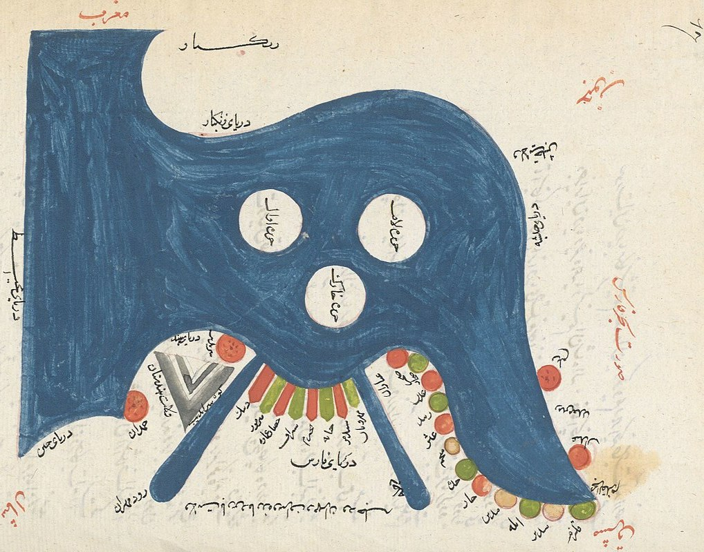

# MMES-Ox
This repo contains teaching materials for the Modern Middle Eastern Studies core course in Quantitative Research Methods, University of Oxford.

## Weekly seminar readings and sections

1. Introduction: \[[Section](https://rawcdn.githack.com/cjbarrie/MMES-Ox/67a3daa11264bcce16d328046f7da0b5f2e490cb/MMES-2021/_book/introduction.html)\]
2. Week 1 readings: Surveys and experiments \[[Section](https://rawcdn.githack.com/cjbarrie/MMES-Ox/67a3daa11264bcce16d328046f7da0b5f2e490cb/MMES-2021/_book/week-1-surveys-and-experiments.html)\]
3. Week 2 readings: Event data \[[Section](https://rawcdn.githack.com/cjbarrie/MMES-Ox/67a3daa11264bcce16d328046f7da0b5f2e490cb/MMES-2021/_book/week-2-event-data.html)\]
4. Week 3 readings: Spatial data \[[Section](https://rawcdn.githack.com/cjbarrie/MMES-Ox/67a3daa11264bcce16d328046f7da0b5f2e490cb/MMES-2021/_book/week-3-spatial-data.html)\]
5. Week 4 readings: Online and text data \[[Section](https://rawcdn.githack.com/cjbarrie/MMES-Ox/67a3daa11264bcce16d328046f7da0b5f2e490cb/MMES-2021/_book/week-4-online-and-text-data.html)\]
6. Week 1 exercise: \[[Section](https://rawcdn.githack.com/cjbarrie/MMES-Ox/67a3daa11264bcce16d328046f7da0b5f2e490cb/MMES-2021/_book/week-1-exercise.html)\]
7. Week 2 exercise: \[[Section](https://rawcdn.githack.com/cjbarrie/MMES-Ox/67a3daa11264bcce16d328046f7da0b5f2e490cb/MMES-2021/_book/week-2-exercise.html)\]
8. Week 3 exercise: \[[Section](https://rawcdn.githack.com/cjbarrie/MMES-Ox/67a3daa11264bcce16d328046f7da0b5f2e490cb/MMES-2021/_book/week-3-exercise.html)\]
9. Week 4 exercise: \[[Section](https://rawcdn.githack.com/cjbarrie/MMES-Ox/67a3daa11264bcce16d328046f7da0b5f2e490cb/MMES-2021/_book/week-4-exercise.html)\]

